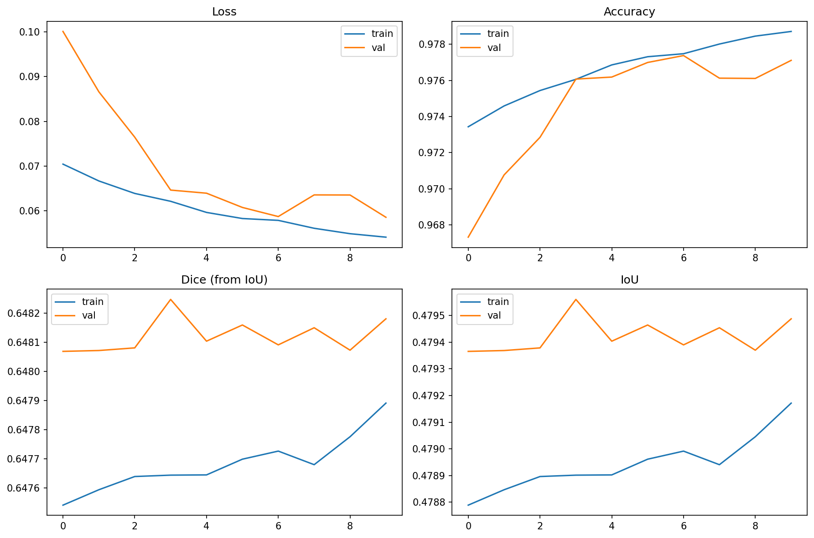
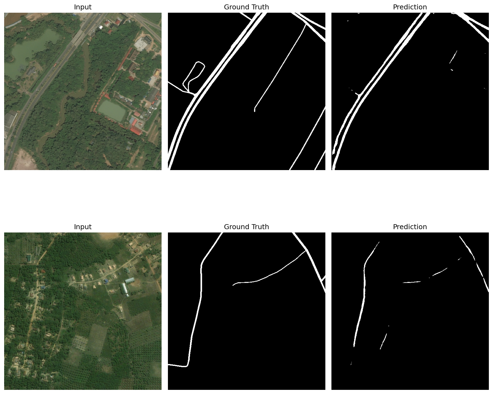

# Road Extraction Using U-Net

## Project Overview
This project implements a deep learning pipeline for automatic road extraction from satellite imagery using a U-Net convolutional neural network architecture. The objective is to segment road networks accurately and efficiently from high-resolution aerial and satellite images, supporting applications in urban planning, navigation systems, and disaster response.

## Dataset
- **DeepGlobe Road Extraction Dataset**
- High-resolution satellite images with annotated binary road masks
- Data split: training, validation, and testing subsets

## Preprocessing
- Conversion of images and masks into standardized input format
- Image resizing and normalization
- Data augmentation to improve model robustness, including:
  - Rotation
  - Horizontal and vertical flipping
  - Random zoom

## Model Architecture
- **Base Model:** U-Net
- Layers:
  - Convolutional layers
  - Max-pooling layers
  - Dropout layers (regularization)
  - Fully connected dense layers
- Activation functions: ReLU and Sigmoid
- Optimizer: Adam (learning rate = 1e-4)
- Loss function: Binary Cross-Entropy combined with Dice Loss

## Training Procedure
- Number of epochs: 10
- Batch size: 4
- Metrics monitored:
  - Accuracy
  - Dice Coefficient
  - Intersection over Union (IoU)

## Evaluation
- Validation Accuracy: ~97.2%
- Dice Coefficient: ~0.66
- IoU: ~0.53
- Loss and metric curves were tracked for both training and validation phases

## Results
- Training curves:  
  

- Example segmentation results:  
  

## Saved Artifacts
The following files are included in the repository for reproducibility:
- Trained model: `unet_ft_best.keras`
- Model weights: `unet_final.weights.h5`
- Metrics:
  - `metrics_table.csv`
  - `metrics.json`
  - `val_metrics.json`
- Figures:
  - `training_curves.png`
  - `fig_results.png`

## Reproducibility
The complete workflow, including data loading, preprocessing, training, evaluation, and visualization, is available in the Kaggle notebook:  
[Link to Kaggle Notebook] https://www.kaggle.com/code/nurbali/road-extraction-unet-cnn

---

## References
- Iglovikov, V., & Shvets, A. (2018). *TernausNet: U-Net with VGG11 Encoder Pre-Trained on ImageNet for Image Segmentation.*  
- DeepGlobe 2018 Road Extraction Challenge Dataset.
- Iglovikov, V., & Shvets, A. (2018). *TernausNet: U-Net with VGG11 Encoder Pre-Trained on ImageNet for Image Segmentation.*  
- DeepGlobe 2018 Road Extraction Challenge Dataset.  
